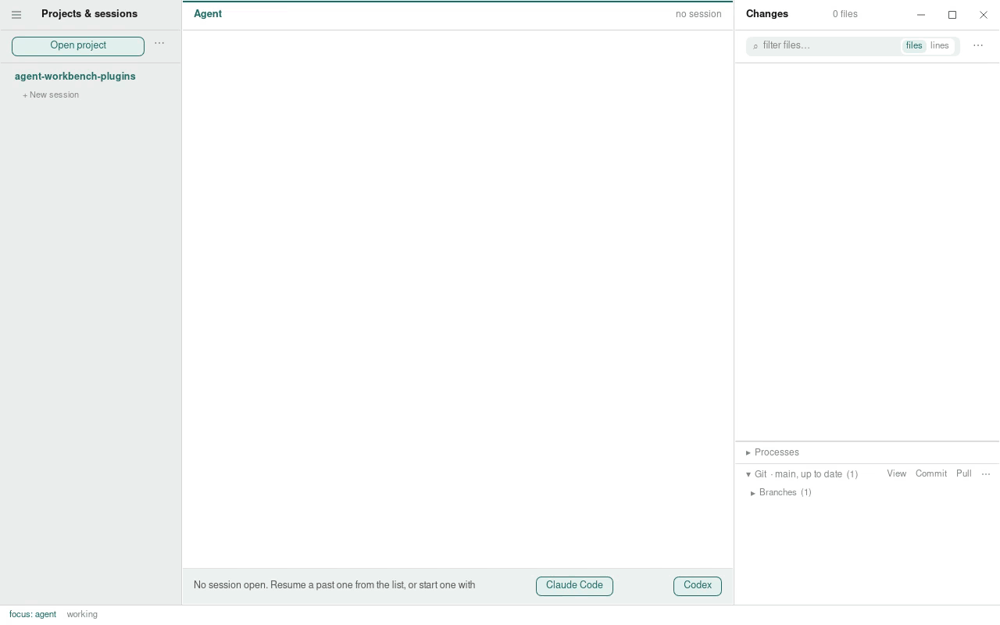

# Agent Workbench

A desktop app for working with coding agents that run as terminal programs,
Claude Code and Codex CLI today. It puts the agent's own interface in the
middle, the project's live git changes beside it, and every project and
session you have going down the left, so you can run several agents at once,
see what each one changed as it happens, and come back to a session later.

The agents are not wrapped or replaced. Each runs in a real pty, full screen,
with the keyboard almost entirely its own. The app adds what a terminal
window lacks: the changes as they land, past sessions to resume, a session's
state at a glance, and projects on other machines over ssh.



## What it does

- **Sessions.** Open a folder and start a session in it, or resume one the
  agent had there before. Several projects and sessions run side by side;
  switching between them stops nothing. A session's row says whether the
  agent is working, waiting for you, or asking for permission.
- **Changes.** The changed files and their diffs, refreshed as the agent
  edits, with a file viewer and search over the tree. A session that moves
  into a git worktree takes the pane with it.
- **Terminal.** Plain shells under the panes, per project, split if you like.
- **Remote projects.** Pair a machine with one pasted token, or name a host
  your ssh already reaches, and work in a folder there. The agent, the
  changes and the shells run on that machine; the window does not know the
  difference. See [remote](docs/remote.md).
- **Keyboard first.** The agent owns the keyboard. The app claims a few
  modifier chords, all of them yours to change. See
  [focus](docs/focus-model.md).

## Platforms

macOS, Linux and Windows. The window is the app's own on all three: the
traffic lights over the leftmost pane on macOS, app-drawn controls on the
others. [Platforms](docs/platforms.md) has what differs.

## Installing it

Every [release](https://github.com/elva-labs/agent-workbench/releases) carries
installers: `.dmg` for macOS on either chip, `.AppImage`, `.deb` and `.rpm`
for Linux, `.msi` and a setup `.exe` for Windows. The macOS builds are signed
and notarized. On macOS there is also a tap:

```
brew tap elva-labs/elva
brew install --cask agent-workbench
```

## Running it from source

```
npm install
npm run tauri dev
```

Linux needs the WebKitGTK development packages Tauri asks for, plus
`libxdo-dev`, `libayatana-appindicator3-dev` and `librsvg2-dev`.

## Verifying it

```
npm run verify        # types, unit, Rust, end-to-end
npm run test:driver   # the real binary, driven over WebDriver
```

[Testing](docs/testing.md) says what each tier covers.

## Reading

- [Architecture](docs/architecture.md): the one rule, the two halves, and
  the core that runs without a window.
- [Layout](docs/layout.md): the two shapes, what gives way when the window
  shrinks, the terminal panel, the window's chrome.
- [Sessions](docs/sessions.md): what a session is, what its row says, past
  sessions, and how the changes pane keeps up.
- [Focus](docs/focus-model.md): who owns the keyboard.
- [Settings](docs/settings.md): appearance, palettes, keys, live updates.
- [Hooks](docs/hooks.md): what the app installs in a project when asked, and
  what it gives, the agent's tools to show you a place in a file and to
  present what it made among it.
- [Agents](docs/adapters.md): Claude Code and Codex CLI, and how they differ.
- [Remote](docs/remote.md): projects on other machines.
- [Platforms](docs/platforms.md): what differs on each.
- [Testing](docs/testing.md) and [CI and releases](docs/release.md).
