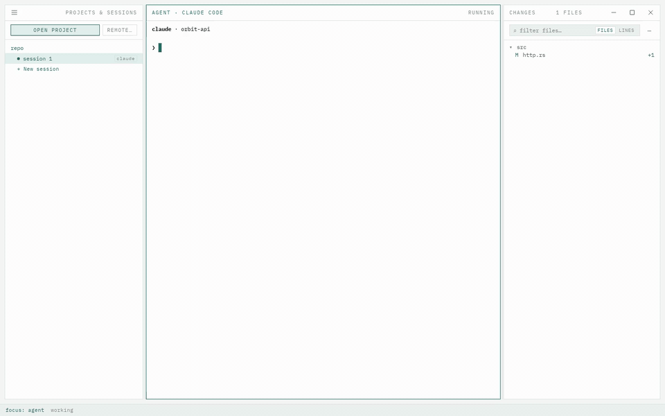
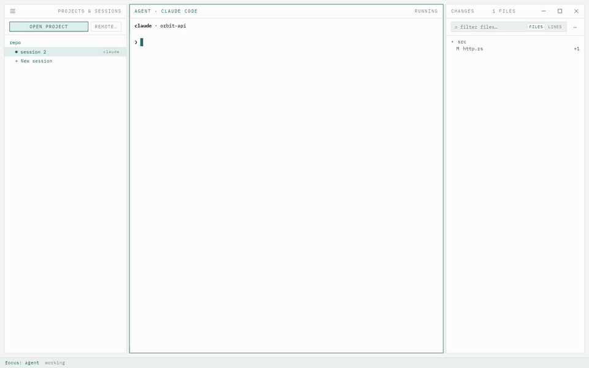
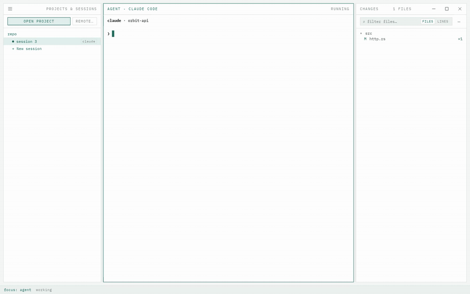
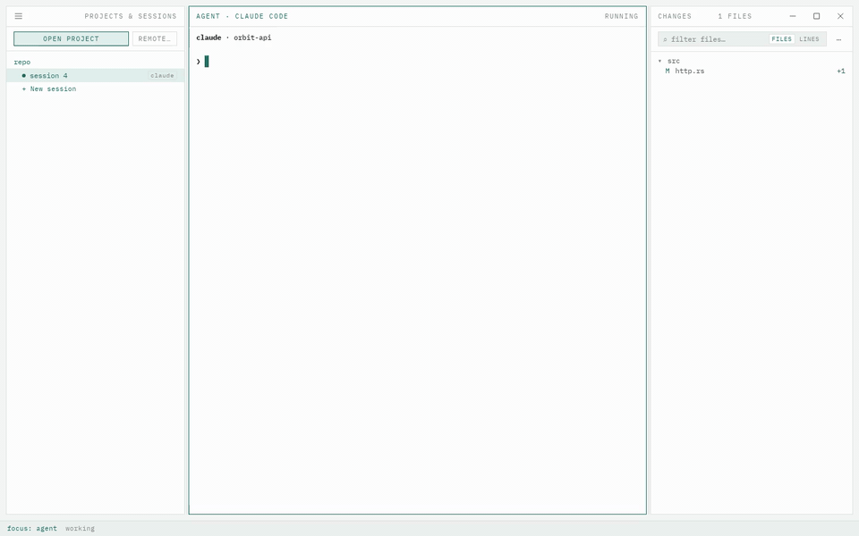

# Hooks

Both agents can run commands of the user's at points in a session: when a
tool finishes, when a prompt is sent, when a turn ends, when permission is
asked. The app can install a few of its own, chosen once in the settings for
every project, with a word for any project that should go the other way.
Each project is brought to that choice as it is opened. A fresh install has
them on; a setup from before the choice keeps them off until asked, since
they write into the project's own agent configuration. Such a setup is
told once, in a word over the agent pane, what turning them on gives; its
link opens the settings at the section, and the word goes for good when it
is dismissed or when hooks are turned on.

## What is installed

For Claude Code, entries in the project's `.claude/settings.local.json`:
one after every tool use, which writes what the agent just did to a file
the changes pane watches, and one each for prompt submitted, stop and
notification, which append what the agent reported to a session log under
the app's own directory in the user's home.

For Codex, entries in the project's `.codex/hooks.json` for prompt
submitted, stop and permission request, appending to the same log.

Neither file turns up in a diff or as untracked: installing adds both to
the repository's own exclude list, the one git keeps outside the commits,
under `.git/info/exclude`. Claude Code does the same for its local settings
file the first time it writes one; the app does it in case it gets there
first, and for the Codex file, which Codex leaves alone. The two lines stay
in the exclude list when the hooks are turned off, where they do nothing.

## What they give

The changes pane hears the moment a tool finishes, and hears what the agent
did rather than inferring it from the filesystem. A session's row follows
the agent's own word for working, waiting and asking for permission, in
place of the reading off its output. [Sessions](sessions.md) describes both.

The session log holds a line per event and is trimmed once it grows past
half a megabyte; nothing in it is needed after the window has seen it.

## The agent's tools

With the hooks go six tools for the agent, offered over MCP by the daemon,
which the app puts on the machine alongside. The first, `show`, is the
pattern for the rest. Called with a file, a
range of lines and a note, it opens the file in the changes pane's viewer,
scrolled to the lines with them highlighted and the note above, in the
project the agent runs in, brought forward if it was not on screen. The
daemon tells the agent when to reach for it as it connects: when the user
asks where something is, or an answer points at a place in a file, once,
for the place being talked about. Claude Code is pointed at the server in
its own per-project state under the user's home; Codex in the project's
`.codex/config.toml`, kept out of the repository like the hooks file. A
machine kind the app has no daemon build for gets the hooks without the
tool. An app run from the source uses the daemon built beside it.

A reference the agent writes in its answer, `src/lib/a.ts:12`, opens the
same way on a click with the modifier a link takes, with nothing installed.

A second, `diff`, opens a file's changes in the viewer the same way, with
a note above, for when the agent points at what changed rather than at a
line. A file git has not changed opens as it is.

The third tool, `present`, is for what the agent made or found to look at:
one or more images, PDFs, Markdown documents, HTML pages or Mermaid
diagrams, with a caption. The call opens in the changes pane's viewer,
where a file would: every file of it down the viewer under its name, an
image at width, a PDF in its own frame, a document rendered, a page in a
frame of its own that can run its scripts but reach nothing of the app or
the machine, a diagram drawn, a mermaid fence in a document drawn too, the
caption in the bar above. Escape closes it as it
closes a file.

 A link in a document opens outside the app; HTML written
into a document shows as the text it is. What was presented stays on the media
list of the session it came from, a section under the file tree with a
divider to drag and a header that folds it away, one row per call under
its caption, to open again after a restart too. The rows are the file
tree's to walk: the arrows run off the end of the tree onto them, Enter
opens a call, and Left and Right fold and unfold the section as they close
and open a folder;
the list names the files where they are rather than keeping copies, so one
the agent later removes shows as gone. Files are read where the agent runs,
a remote included, up to eight megabytes each. Video is not among the kinds
taken yet.

The fourth tool, `selection`, runs the other way: the agent asks what the
user is looking at, and is told the file open in the viewer, whether as its
diff or as it is, the lines selected in it with the mouse or pointed at by
a tool, or what was presented, in words. "Explain this" then needs no path,
and lines selected in the viewer stay marked when the keyboard moves to the
agent, so they are still the answer while the question is typed. The app keeps that on record on
the project's machine, under the same directory as the request log, and
clears it when nothing is open.

Two more are for the agent to hand something over rather than show it.
`terminal` opens a new terminal in the panel with a command typed at the
prompt and not run, from the directory the agent works in: a dev server or
a watch the user asked for, which they start with Enter and keep. The
agent is told to run its own commands itself.

`notify` leaves one line under the session's name in the sessions pane and
marks the row as wanting attention, for when the user is in another
session: why the agent stopped, what it needs, what is done. The row has
room for a few words on one line and cuts the rest off, which the agent is
told. Looking at the session clears it. The agent is told to use it once,
when it stops, and not for progress.

Seven more are the orchestrator's, for a session that starts and steers
other sessions: what they do and what the user is asked is in
[orchestrator](orchestrator.md).

## Removing them

Turning hooks off for a project removes the app's entries and nothing else.
A Codex hooks file the app created and emptied is deleted with them. On a
remote project the same is done on that machine.
