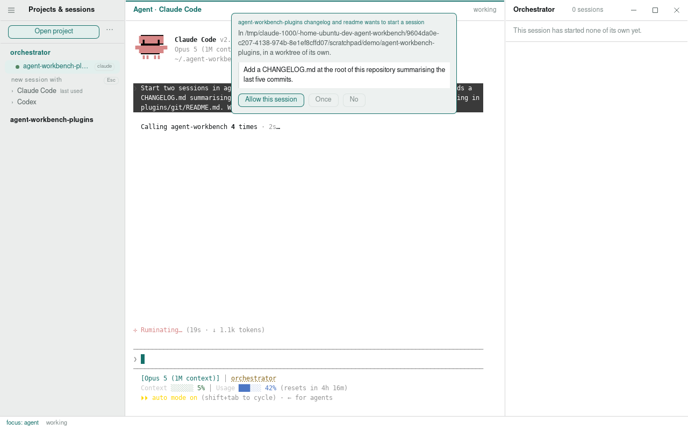
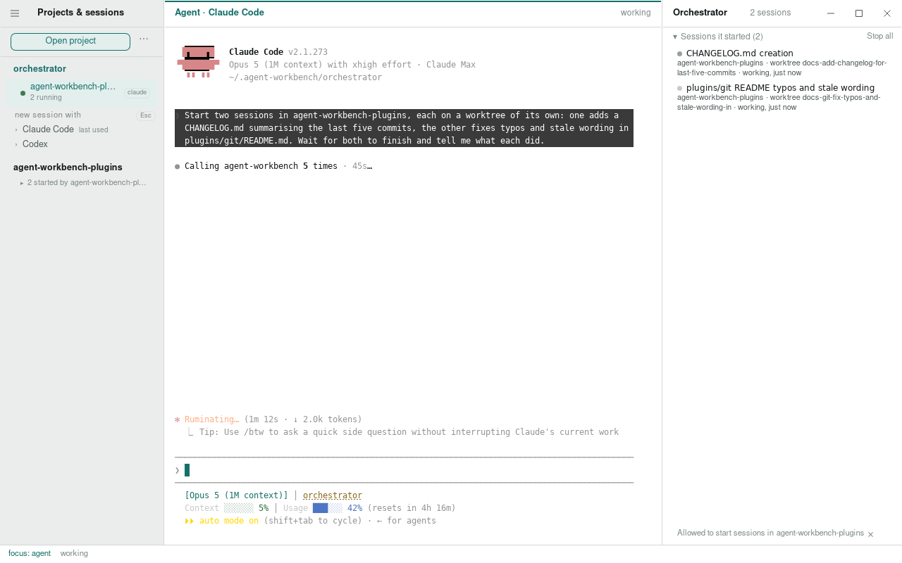

# The orchestrator

An orchestrator is a session that starts and steers other sessions. It is a
session like any other, an agent in a pty with a terminal of its own, and
you talk to it the way you talk to any agent. What it has that the others
do not is a set of tools for the sessions around it: it can see the open
projects, start a session in one of them with a prompt, send a running
session a line, wait until one of them stops or asks for something, read
what one has on screen, and stop them.

It runs in a project of its own, `orchestrator` under the workbench's home.
The first one starts from New orchestrator session, in the menu beside Open
project; from then on the project sits above the ones you opened, with its
sessions and the past ones to resume, and a session started there is an
orchestrator. With more than one agent installed its new-session row opens
into a row per agent, as any project's does. Nothing else about it differs,
except what it is told: an orchestrator is told to direct work rather than
do it, to start a session per piece in the project it belongs to, on a
worktree of its own when pieces touch the same files, to wait on them rather
than ask after them in a loop, to put the user's whole task in the prompt it
starts a session with and none of its own housekeeping, and to leave a line
on its own row when it stops, whether to relay a question or to report.
Every other session has the same tools and none of the nudge.

## The tools

The seven tools reach the workbench through the same tool server the app's
own tools use. The orchestrator's own directory carries them whatever the
projects were told about live updates; any other session has them where its
project's hooks are on. See [hooks](hooks.md).

`projects` lists the open projects, the caller's own marked, so a session
names a project the app actually has. `sessions` lists the sessions the
caller started, each with its id, its project and worktree, its agent, what
it is doing and the last line it left. `start` starts a session in a project with a first
prompt, on a worktree of its own if it asks for one, and answers with the
new session's id. `send` types a line into a running session, and Enter after it on its
own, as a person does. `wait` sits
until a session stops working, asks for permission or ends, or until the
seconds it was given run out. `read` answers with the last lines on a
session's screen, as you see them. `stop` stops a session and files it
with the sessions to resume, behind the fold, rather than leaving a row
of it under the project. A start can carry a name for the work, which the
session's row and its worktree take; a name the project already has is
numbered rather than refused, so the same work twice is fix-it and fix-it-2.
A worktree it starts in is trusted where its project is, with either agent,
so nothing asks on the way in. A start can also name a model, which goes to
the agent on its command line and holds from the session's first turn, so
an orchestrator chooses the model for a piece of work when it starts it
rather than sending a model command afterwards. A model's name belongs to
one agent, so a start that names a model names the agent too, and one
that leaves the agent out is refused rather than given the project's last.

## What is remembered

What a session started is written down by session id, with the project,
the worktree, the agent and the name, and kept between runs beside the
sessions the app knows as its own. An orchestrator closed and resumed
keeps its id, so the sessions it started are still its own: the ones
still running answer to its tools as before, and a row with one of its
ids, resumed from the pane by hand, is folded under it all the same. When
the app itself was closed, the orchestrator comes back with the other
sessions that were open, and the sessions it started do not. `sessions`
then lists them as stopped, after the running ones, and `start` with one
of those ids in place of a project and prompt brings it back where it ran,
in its worktree with its conversation. A prompt given with it is what the
session goes on with; without one it comes up waiting for a line. The cap
and the one-level rule apply, and a session whose worktree has since been
cleaned up, or whose project is no longer open, is refused with the
reason. A session the orchestrator
stopped itself is not offered back: the stop said it was done with. The
record lives with the window's other memory, so a wiped local storage
forgets it, which only means the orchestrator starts afresh.

A session it starts is asked, at the end of its prompt, to leave a line on
its row when it is done or stuck, so the fold, the board and the wait tool
all say how it went.

The tools act on the sessions the caller started and on no others. A
session you started yourself is yours, on a subject of your own: another
agent cannot type into it, stop it, read it or so much as list it,
whatever it has been told to do by something it read.

## What the user is asked

The first time a session asks to start another in a project, the window
puts the question up over the agent pane and holds the call until it is
answered: allow it from now on, allow this one, or refuse. An allowed
caller is remembered for that project for as long as the app runs. A
refusal is an answer the agent reads, not an error. Bringing back a
session it already started is never asked about: the consent was given
when the session was, and the resumed session is that one going on.

A session started by another may not start any of its own, and no session
may have more than eight running at a time.

## In the panes

The sessions an orchestrator started stay in the project they run in, where
the work is, and keep out of the way: the pane folds them into one quiet
line per orchestrator, "2 started by Retry rollout", which opens into a row
each. The line speaks up in the accent when one of them is waiting on you,
"1 asking", so the place to go is still the orchestrator and not the
session it started.

The orchestrator's own row says what it has out, "3 running, 1 asking", and
its changes pane, headed Orchestrator, shows the sessions it started instead
of a file tree: each with its project, its worktree, what it is doing, how
long it has been at it and the line it left, with Stop all on the section's
header. Each row can be stopped on its own, or sent a line without leaving the
orchestrator. Under the list, the projects the orchestrator has been allowed
to start sessions in, each with a way to take that back, and the worktrees its
starts have left behind, with Clean up for the ones whose work is merged and
whose trees are clean; the rest say why they stay.

The sessions it started keep out of the keyboard's way too: Delete on one
of them does nothing, and a fold stops the lot from its own hover action.

## Where the work happens

An orchestrator directs; it does not edit. The sessions it starts run in
their own projects, on their own branches when they asked for a worktree,
each with its own terminal and scrollback, and they are sessions you can
open, type in and take over at any point.
