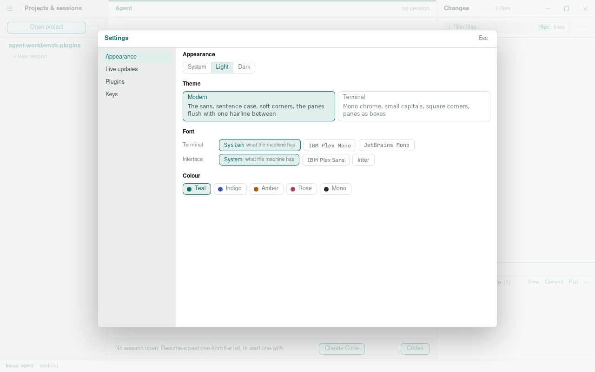

# Settings

Settings open from the native menu, or with <kbd>Cmd</kbd><kbd>,</kbd>
(<kbd>Ctrl</kbd> on Windows and Linux), over the workbench. A choice applies
at once.

The settings are in four tabs down the left. Appearance carries the
appearance, theme, font and colour sections; live updates, plugins and keys
each carry the section of that name. Opening the settings again lands on the
tab last used, for as long as the window is open. The dialog follows the look
the panes are drawn in.

## Appearance

System, light or dark. System follows the desktop and changes with it.

## Theme

Modern or terminal, modern to begin with. Modern sets the chrome in the
sans, in sentence case, with soft corners and the three panes flush on one
surface, a single hairline between each pair and the sessions pane a shade
below; that hairline is the resize bar itself, with three pixels either side
of it to take hold of, and it turns accent under the pointer. Terminal is mono
chrome, small capitals, square corners and panes drawn as boxes. The focused
pane is marked in the accent either way, its title with it: an edge along the
header under modern, the pane's own border under terminal. Both use the same
colours, so the appearance and the palette hold across either.

## Font

Two families, chosen apart: the one the terminal draws in and the one the
rest of the app is set in. Each starts on the machine's own, the monospace
and the sans the system draws with; the terminal can have IBM Plex Mono or
JetBrains Mono instead, and the interface IBM Plex Sans or Inter, all four
shipped with the app. Each name is shown in its own face. A change reaches
every open terminal at once, which measures its grid again and tells the
process the size it now has, so there is nothing to restart.

## Colour

Five palettes: teal, indigo, amber, rose and mono. Every colour in the app
comes from a small set of semantic tokens, ink, surface, rule, accent, add,
del, and a palette restates the accent and the cast of the greys for both
appearances while add and del stay what they are. The terminal's sixteen
ANSI colours are derived from the same tokens, so the agent's own interface
sits in the palette rather than beside it.

## Live updates

Watcher only, or agent hooks, chosen once for every project; each project
you open follows it, and a project that should go the other way can say so
under it. A fresh install starts with the hooks on; a setup from before the
choice existed starts with them off, and is told once, in a word over the
agent pane, what turning them on gives; the word's link opens the settings
at this section. What each means for the changes pane and for a session's
row is in [sessions](sessions.md); what the hooks write and where, and the
tools they bring the agent, is in [hooks](hooks.md).

## Plugins

Sources of plugins, each a git repository or a directory on this machine, with
the plugins each names, what each plugin is for and how it is faring, and a
switch per plugin. Check for updates, at the top, asks every fetched source at
once. The sources the workbench knows are listed from the first launch with
every plugin off, and turning one on fetches its source first. A source of
your own goes in behind Add a source, under them. What adding, enabling,
checking and updating do is in [plugins](plugins.md).

## Keys

The whole chord table, with two presets and room for your own. What the app
may claim and why is in [focus](focus-model.md).

## Where they are kept

The appearance, the look, the palette, the fonts, the chords and the answer
on hooks are kept for the machine, in `settings.json` under
`~/.agent-workbench`, and every window on the machine follows the same file.
The window reads it at start and hears of every change to it, whether made
in the settings, by another window, or by an edit to the file itself, which
reaches an open window at once. A value in the file that the app does not
know is passed over and the default stands for it.

The window keeps a copy of its own as well, so the first frame of a start is
painted as the last one was before the file has been read. On a machine
without the file, that copy is what the file is first written from.

The plugins keep their own record, described in [plugins](plugins.md). A
window on a remote machine's project still follows the settings of the
machine the window runs on.
